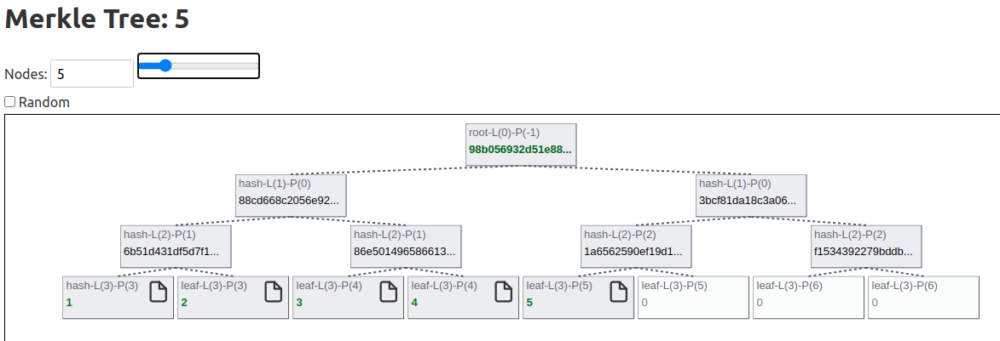

## Simple MerkleTree visualizer

It expects GraphQL server running on [http://localhost:8081](http://localhost:8081)



### Get started

Install the dependencies...

```bash
npm install
```

Start [Rollup](https://rollupjs.org):

```bash
npm run dev
```

Open [localhost:5000](http://localhost:5000). 